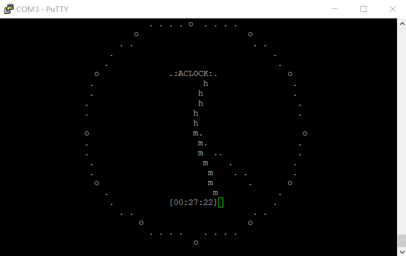

# aclock for RT-Thread 
## 终端钟表

原作者：https://github.com/tenox7/aclock/blob/master/sources/aclock-vt100.c

在ENV工具的配置方法：

```
 RT-Thread online packages  --->
    miscellaneous packages  --->
        entertainment: terminal games and other interesting software packages  --->
            [*] aclock: a terminal clock
```

安装本软件包后，在终端输入aclock命令，即可看见钟表界面。

```shell
msh> aclock
```

